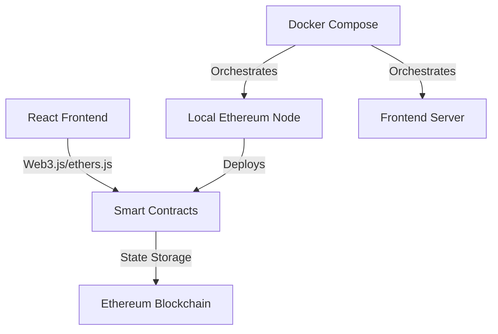
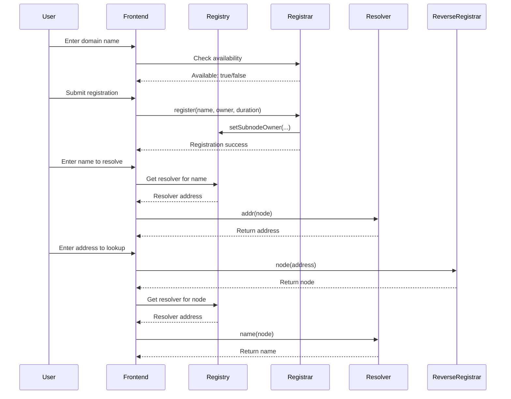
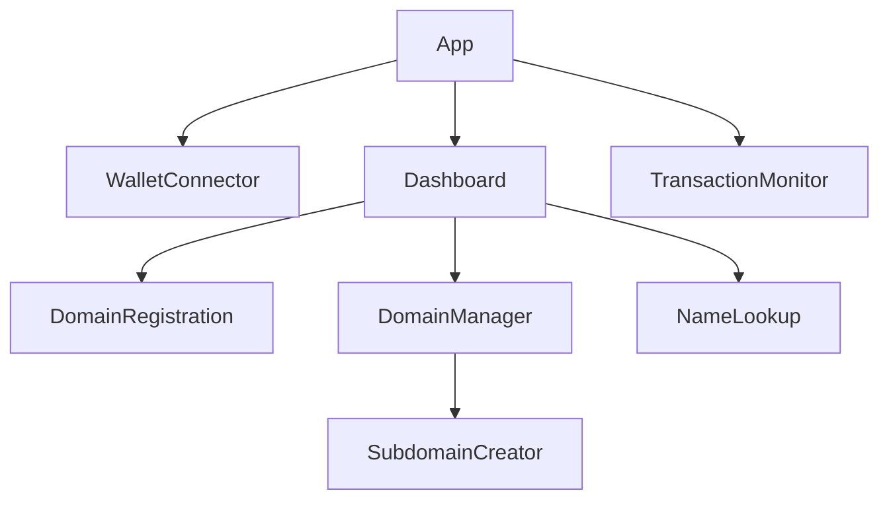

# Design Document: ENS Demo Project

## Overview

This document outlines the design for an Ethereum Name Service (ENS) demo project. The project aims to create a simplified but functional implementation of ENS core features for educational purposes. The system will consist of smart contracts implementing ENS functionality and a React-based frontend for user interaction. The entire stack will be deployable via Docker Compose for ease of use.

## Architecture

The ENS demo will follow a layered architecture with the following components:



### Contract Interaction Flow



### System Components

1. **Smart Contracts Layer**
   - ENS Registry Contract
   - Registrar Contract
   - Resolver Contract
   - Reverse Registrar Contract

2. **Frontend Layer**
   - React Application
   - Web3 Integration (ethers.js)
   - UI Components

3. **Infrastructure Layer**
   - Local Ethereum Node (Anvil)
   - Docker Containers
   - Development Tools

## Components and Interfaces

### Smart Contracts

#### ENS Registry Contract

The core contract that maintains the mapping of domain names to owners and resolvers.

```solidity
interface IENSRegistry {
    function owner(bytes32 node) external view returns (address);
    function resolver(bytes32 node) external view returns (address);
    function ttl(bytes32 node) external view returns (uint64);
    function setOwner(bytes32 node, address owner) external;
    function setSubnodeOwner(bytes32 node, bytes32 label, address owner) external returns (bytes32);
    function setResolver(bytes32 node, address resolver) external;
    function setTTL(bytes32 node, uint64 ttl) external;
}
```

#### Registrar Contract

Handles the registration of domain names, including payment processing and expiration logic.

```solidity
interface IRegistrar {
    function register(string calldata name, address owner, uint256 duration) external payable returns (uint256);
    function renew(string calldata name, uint256 duration) external payable;
    function available(string calldata name) external view returns (bool);
    function nameExpires(uint256 id) external view returns (uint256);
}
```

#### Resolver Contract

Stores and provides resolution data for domain names.

```solidity
interface IResolver {
    function addr(bytes32 node) external view returns (address);
    function setAddr(bytes32 node, address addr) external;
    function name(bytes32 node) external view returns (string memory);
    function setName(bytes32 node, string calldata name) external;
    function supportsInterface(bytes4 interfaceID) external pure returns (bool);
}
```

#### Reverse Registrar Contract

Manages reverse resolution (address to name).

```solidity
interface IReverseRegistrar {
    function setName(string calldata name) external returns (bytes32);
    function node(address addr) external pure returns (bytes32);
}
```

### Frontend Components

#### Core Components

1. **WalletConnector**
   - Handles wallet connection and authentication
   - Displays current account information

2. **DomainRegistration**
   - Form for registering new domains
   - Payment handling
   - Registration status display

3. **DomainManager**
   - List of owned domains
   - Domain management options
   - Subdomain creation interface

4. **NameLookup**
   - Forward resolution (name to address)
   - Reverse resolution (address to name)
   - Resolution results display

5. **TransactionMonitor**
   - Displays pending transactions
   - Shows success/error messages
   - Transaction history

#### Component Hierarchy



## Data Models

### Smart Contract Data Structures

1. **Domain Node**
   - Represented as a bytes32 hash
   - Created using namehash algorithm

2. **Domain Record**
   - Owner address
   - Resolver address
   - TTL (Time to Live)
   - Expiration timestamp

3. **Resolver Record**
   - Address mapping
   - Name mapping
   - Other optional data (text records, content hash, etc.)

### Frontend Data Models

1. **Domain**
```typescript
interface Domain {
  name: string;
  node: string; // bytes32 hash
  owner: string; // address
  resolver: string; // address
  expiryDate: Date;
  subdomains?: Domain[];
}
```

2. **Transaction**
```typescript
interface Transaction {
  hash: string;
  status: 'pending' | 'success' | 'failed';
  type: 'registration' | 'renewal' | 'update' | 'subdomain';
  timestamp: Date;
  domain?: string;
  error?: string;
}
```

3. **User**
```typescript
interface User {
  address: string;
  domains: Domain[];
  transactions: Transaction[];
  balance: string;
}
```

## Error Handling

### Smart Contract Error Handling

1. **Require Statements**
   - Input validation
   - Authorization checks
   - State validation

2. **Custom Errors**
   - Defined using Solidity's `error` keyword
   - Include relevant parameters for debugging

3. **Events**
   - Emit events for all state changes
   - Include relevant parameters for tracking

### Frontend Error Handling

1. **Transaction Errors**
   - Display user-friendly error messages
   - Provide retry options when appropriate
   - Log detailed errors for debugging

2. **Network Errors**
   - Handle disconnections gracefully
   - Implement reconnection logic
   - Cache pending transactions

3. **Input Validation**
   - Client-side validation before sending transactions
   - Clear error messages for invalid inputs
   - Prevent submission of invalid data

## Testing Strategy

### Smart Contract Testing

1. **Unit Tests**
   - Test individual contract functions
   - Use Foundry's testing framework
   - Cover both success and failure cases

2. **Integration Tests**
   - Test interactions between contracts
   - Simulate complex scenarios
   - Test with various account types

3. **Fuzz Testing**
   - Use property-based testing
   - Test with random inputs
   - Identify edge cases

### Frontend Testing

1. **Component Tests**
   - Test individual React components
   - Mock blockchain interactions
   - Verify UI behavior

2. **Integration Tests**
   - Test component interactions
   - Test form submissions
   - Verify state management

3. **End-to-End Tests**
   - Test complete user flows
   - Use a local blockchain for testing
   - Verify contract interactions

## Monorepo Structure

```
ens-demo/
├── README.md
├── package.json
├── docker-compose.yml
├── contracts/
│   ├── src/
│   │   ├── ENSRegistry.sol
│   │   ├── Registrar.sol
│   │   ├── Resolver.sol
│   │   └── ReverseRegistrar.sol
│   ├── test/
│   │   ├── ENSRegistry.t.sol
│   │   ├── Registrar.t.sol
│   │   ├── Resolver.t.sol
│   │   └── ReverseRegistrar.t.sol
│   ├── script/
│   │   ├── Deploy.s.sol
│   │   └── Seed.s.sol
│   └── foundry.toml
├── frontend/
│   ├── public/
│   ├── src/
│   │   ├── components/
│   │   │   ├── WalletConnector.tsx
│   │   │   ├── DomainRegistration.tsx
│   │   │   ├── DomainManager.tsx
│   │   │   ├── NameLookup.tsx
│   │   │   └── TransactionMonitor.tsx
│   │   ├── hooks/
│   │   │   ├── useENS.ts
│   │   │   ├── useWallet.ts
│   │   │   └── useTransactions.ts
│   │   ├── utils/
│   │   │   ├── namehash.ts
│   │   │   └── formatters.ts
│   │   ├── App.tsx
│   │   └── index.tsx
│   ├── package.json
│   └── tsconfig.json
└── scripts/
    ├── setup.sh
    ├── deploy-contracts.sh
    ├── update-abis.sh
    └── start-dev.sh
```

## Docker Compose Configuration

The Docker Compose setup will include:

1. **Local Ethereum Node**
   - Based on Anvil (Foundry's local Ethereum node)
   - Persisted blockchain state
   - Exposed RPC endpoint

2. **Frontend Container**
   - Node.js environment
   - React development server
   - Hot-reloading enabled

3. **Shared Volumes**
   - Contract ABIs
   - Deployment information
   - Development files

4. **Network Configuration**
   - Internal network for container communication
   - Exposed ports for external access
   - Environment variables for configuration

## Implementation Considerations

### Smart Contract Security

1. **Access Control**
   - Clear ownership model
   - Function-level permissions
   - Reentrancy protection

2. **Gas Optimization**
   - Efficient data structures
   - Optimized function calls
   - Batch operations where appropriate

### Frontend Performance

1. **State Management**
   - Efficient React state updates
   - Caching of blockchain data
   - Optimistic UI updates

2. **User Experience**
   - Clear loading indicators
   - Responsive design
   - Intuitive error messages

### Development Workflow

1. **Contract Development**
   - Write contracts
   - Write tests
   - Deploy to local node

2. **Frontend Development**
   - Update ABIs
   - Implement UI components
   - Connect to contracts

3. **Integration**
   - Test end-to-end flows
   - Verify contract interactions
   - Optimize performance
#
# Namehash Algorithm

The ENS system uses a special hashing algorithm called "namehash" to convert domain names into fixed-length identifiers that can be used in the ENS contracts. This algorithm is crucial for the functioning of the ENS system.

```typescript
// Pseudocode for the namehash algorithm
function namehash(domain) {
  if (domain === '') {
    return '0x0000000000000000000000000000000000000000000000000000000000000000';
  }
  
  let labels = domain.split('.');
  let node = '0x0000000000000000000000000000000000000000000000000000000000000000';
  
  for (let i = labels.length - 1; i >= 0; i--) {
    node = keccak256(node + keccak256(labels[i]));
  }
  
  return node;
}
```

The namehash algorithm will be implemented in both the smart contracts (for on-chain operations) and in the frontend (for generating the correct node identifiers for contract calls).

## Docker Compose Configuration Details

The Docker Compose configuration will be defined in a `docker-compose.yml` file at the root of the project. Here's a detailed specification:

```yaml
version: '3.8'

services:
  # Local Ethereum node using Anvil
  anvil:
    build:
      context: ./docker/anvil
      dockerfile: Dockerfile
    ports:
      - "8545:8545"
    volumes:
      - anvil-data:/data
      - ./contracts:/app/contracts
    environment:
      - ANVIL_CHAIN_ID=31337
      - ANVIL_BLOCK_TIME=2
    command: >
      --host 0.0.0.0
      --port 8545
      --chain-id ${ANVIL_CHAIN_ID:-31337}
      --block-time ${ANVIL_BLOCK_TIME:-2}
      --state /data/anvil_state.json
      --auto-impersonate

  # Contract deployment service
  deploy:
    build:
      context: ./docker/foundry
      dockerfile: Dockerfile
    depends_on:
      - anvil
    volumes:
      - ./contracts:/app/contracts
      - ./frontend/src/abis:/app/abis
    environment:
      - RPC_URL=http://anvil:8545
    command: >
      sh -c "cd /app/contracts &&
             forge build &&
             forge script script/Deploy.s.sol --rpc-url $$RPC_URL --broadcast &&
             forge script script/Seed.s.sol --rpc-url $$RPC_URL --broadcast &&
             cp -r out/*.json /app/abis/"

  # Frontend development server
  frontend:
    build:
      context: ./frontend
      dockerfile: Dockerfile.dev
    ports:
      - "3000:3000"
    volumes:
      - ./frontend:/app
      - /app/node_modules
    environment:
      - REACT_APP_RPC_URL=http://localhost:8545
      - REACT_APP_CHAIN_ID=31337
    depends_on:
      - deploy
    command: npm start

volumes:
  anvil-data:
```

## Deployment Process

The deployment process will be automated using Docker Compose and Foundry scripts. Here's the detailed workflow:

1. **Local Development Setup**
   - Run `docker-compose up` to start all services
   - Anvil node starts and creates a local blockchain
   - Deploy service builds and deploys contracts to Anvil
   - Frontend service starts the React development server

2. **Contract Deployment**
   - `Deploy.s.sol` script deploys all contracts in the correct order
   - Sets up initial configuration (root node, TLDs)
   - `Seed.s.sol` script creates example domains for demonstration

3. **ABI Generation**
   - After deployment, contract ABIs are copied to the frontend
   - Frontend automatically uses the latest contract ABIs

4. **Development Workflow**
   - Make changes to contracts and run `docker-compose up deploy` to redeploy
   - Make changes to frontend code with hot-reloading enabled
   - Test interactions between frontend and contracts

## User Interface Mockups

### Dashboard View

```
+-----------------------------------------------+
|  [Connect Wallet]         Account: 0x123...   |
+-----------------------------------------------+
|                                               |
|  ENS Demo Dashboard                           |
|                                               |
|  +-------------------+ +-------------------+  |
|  | Register Domain   | | My Domains        |  |
|  |                   | |                   |  |
|  | [Name Input]      | | - example.eth     |  |
|  | [Duration Input]  | | - test.eth        |  |
|  | [Register Button] | | - demo.eth        |  |
|  +-------------------+ +-------------------+  |
|                                               |
|  +-------------------+ +-------------------+  |
|  | Name Lookup       | | Reverse Lookup    |  |
|  |                   | |                   |  |
|  | [Name Input]      | | [Address Input]   |  |
|  | [Lookup Button]   | | [Lookup Button]   |  |
|  | Result: 0x456...  | | Result: test.eth  |  |
|  +-------------------+ +-------------------+  |
|                                               |
+-----------------------------------------------+
```

### Domain Management View

```
+-----------------------------------------------+
|  [Back to Dashboard]      Account: 0x123...   |
+-----------------------------------------------+
|                                               |
|  Domain: example.eth                          |
|                                               |
|  Owner: 0x123...                              |
|  Expires: July 17, 2026                       |
|                                               |
|  +-------------------+ +-------------------+  |
|  | Update Resolver   | | Create Subdomain  |  |
|  |                   | |                   |  |
|  | [Address Input]   | | [Name Input]      |  |
|  | [Update Button]   | | [Owner Input]     |  |
|  |                   | | [Create Button]   |  |
|  +-------------------+ +-------------------+  |
|                                               |
|  Subdomains:                                  |
|                                               |
|  - sub1.example.eth                           |
|  - sub2.example.eth                           |
|                                               |
+-----------------------------------------------+
```

## Performance Considerations

### Smart Contract Optimization

1. **Storage Optimization**
   - Minimize on-chain storage usage
   - Use mappings instead of arrays where possible
   - Pack related data into single storage slots

2. **Gas Efficiency**
   - Optimize function execution paths
   - Minimize state changes
   - Use events for off-chain data retrieval

### Frontend Optimization

1. **Blockchain Interaction**
   - Batch read operations
   - Implement caching for frequently accessed data
   - Use event listeners instead of polling

2. **Rendering Performance**
   - Implement virtualized lists for large domain collections
   - Optimize component re-renders
   - Use React.memo and useMemo for expensive computations