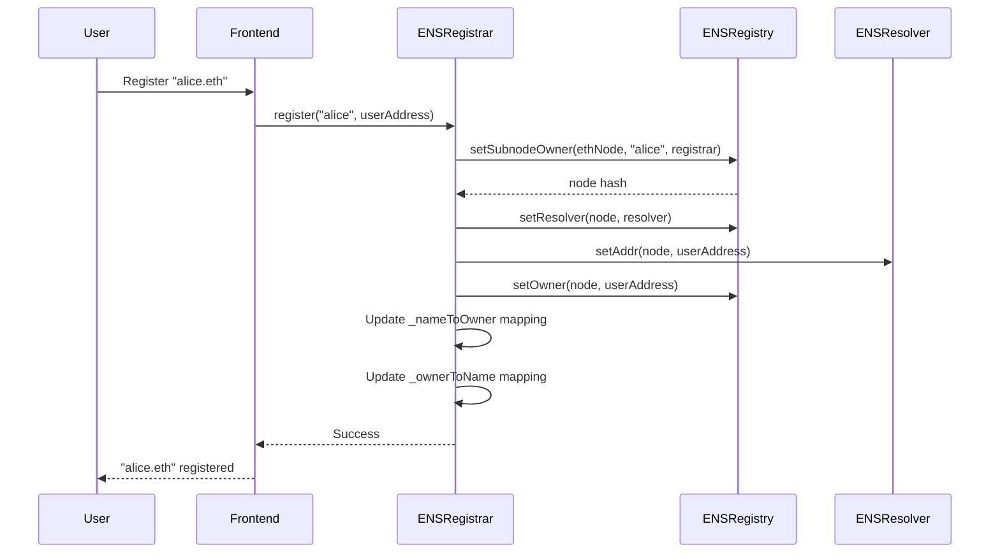
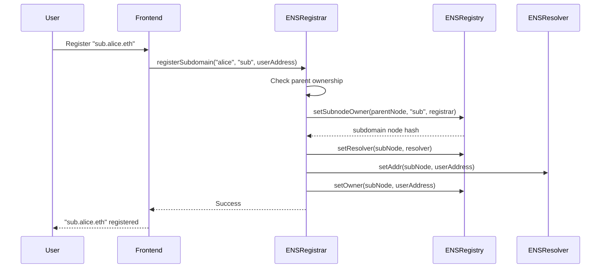
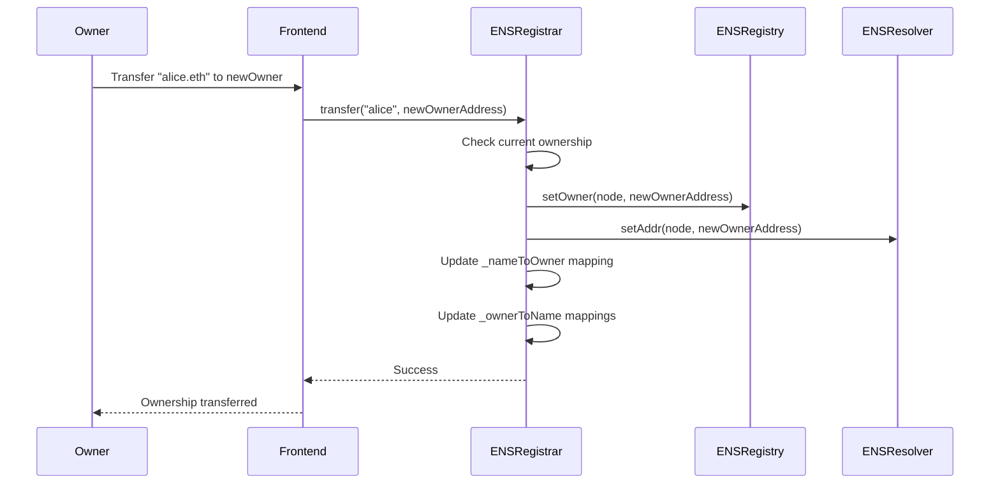
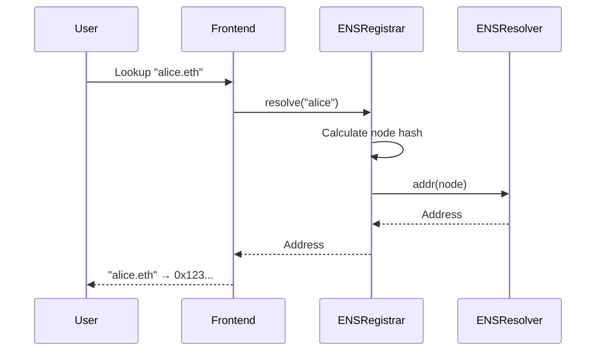
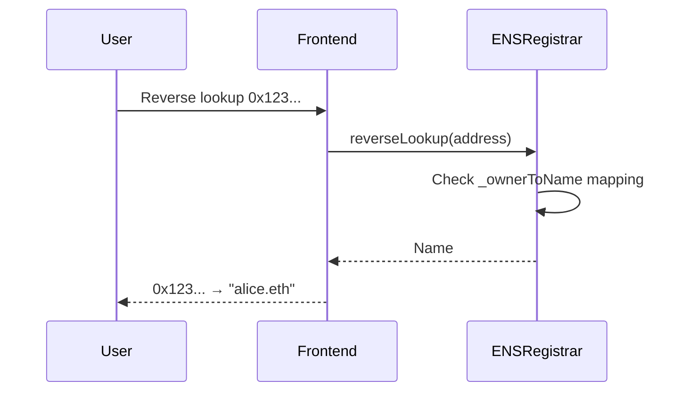

# ENS Demo Project

A learning project that implements a simplified version of the Ethereum Name Service (ENS) with smart contracts and a React frontend.


## Overview

This project demonstrates a simplified ENS (Ethereum Name Service) implementation with a focus on core functionality and clean architecture. It features:

- **Simplified ENS Contracts**: Registry, Registrar, and Resolver contracts built with Foundry
- **Modern React Frontend**: Tabbed interface for core ENS operations using Wagmi hooks
- **Local Development**: Uses Anvil for local Ethereum node without Docker complexity
- **Clean Architecture**: Modular components focusing on 5 core ENS functions:
  - Register a name
  - Register a subdomain  
  - Transfer name ownership
  - Lookup name to address
  - Reverse lookup address to name

## Project Structure

```
ens-demo/
├── contracts/                   # Foundry project for smart contracts
│   ├── src/                     # Contract source code
│   │   ├── ENSRegistry.sol      # Core ENS registry contract
│   │   ├── ENSRegistrar.sol     # Domain registration logic
│   │   └── ENSResolver.sol      # Name resolution contract
│   └── script/                  # Deployment and seeding scripts
│       ├── Deploy.s.sol         # Contract deployment script
│       └── Seed.s.sol           # Test data seeding script
├── frontend/                    # React + TypeScript frontend
│   ├── src/
│   │   ├── components/          # Tabbed ENS interface components
│   │   │   ├── RegisterTab.tsx  # Name registration
│   │   │   ├── SubdomainTab.tsx # Subdomain creation
│   │   │   ├── TransferTab.tsx  # Ownership transfer
│   │   │   ├── LookupTab.tsx    # Name to address lookup
│   │   │   └── ReverseLookupTab.tsx # Address to name lookup
│   │   ├── ENSContracts/        # Contract addresses and ABIs
│   │   │   └── addresses.json   # Deployed contract addresses
│   │   └── generated.ts         # Generated ABIs from Wagmi
│   ├── wagmi.config.ts          # Wagmi configuration (Foundry plugin only)
│   └── package.json             # Frontend dependencies
├── Makefile                     # Build, deploy, and development commands
└── README.md                    # This file
```

## Features

### Smart Contracts (Foundry)
- **ENSRegistry**: Core registry for domain ownership and management
- **ENSRegistrar**: Simplified domain registration without pricing/expiration complexity
- **ENSResolver**: Forward and reverse name resolution
- **Deployment Scripts**: Automated deployment and test data seeding

### Frontend (React + Wagmi)
- **Tabbed Interface**: Clean UI with 5 core ENS functions
- **Wallet Integration**: Connect with MetaMask and other Web3 wallets
- **Real-time Updates**: Live contract interaction with loading states
- **Simplified Wagmi**: Uses standard hooks without generated complexity
- **TypeScript**: Full type safety throughout the application

## Getting Started

### Prerequisites

- Node.js 18+ and pnpm
- Foundry (forge, anvil, cast)
  ```bash
  curl -L https://foundry.paradigm.xyz | bash
  foundryup
  ```

### Quick Start

1. Clone the repository
   ```bash
   git clone https://github.com/pavitra-infocusp/ens-demo.git
   cd ens-demo
   ```

2. Start Anvil (local Ethereum node)
   ```bash
   make anvil
   ```
   This starts Anvil on `http://localhost:8545`

3. Deploy and seed the contracts (in a new terminal)
   ```bash
   make all
   ```
   This builds, deploys, and seeds the ENS contracts. The deployed contract addresses will be saved to `frontend/src/ENSContracts/addresses.json`

4. Generate ABI files for the frontend
   ```bash
   cd frontend
   pnpm wagmi generate
   ```

5. Start the frontend development server
   ```bash
   cd frontend
   pnpm install
   pnpm dev
   ```

6. Open your browser and navigate to `http://localhost:5173`

## Contract Interaction Flow

The following sequence diagrams show how the contracts interact for each core ENS operation:

### 1. Name Registration



### 2. Subdomain Registration



### 3. Name Transfer



### 4. Name Lookup (Name → Address)



### 5. Reverse Lookup (Address → Name)



### Key Contract Interactions:

1. **ENSRegistry**: Core registry that maintains node ownership and resolver mappings
2. **ENSRegistrar**: Business logic for registration, transfers, and lookups
3. **ENSResolver**: Stores address resolution data for each name

**Important**: The registrar temporarily takes ownership during registration to set the resolver, then transfers final ownership to the user. This ensures proper permission handling.

